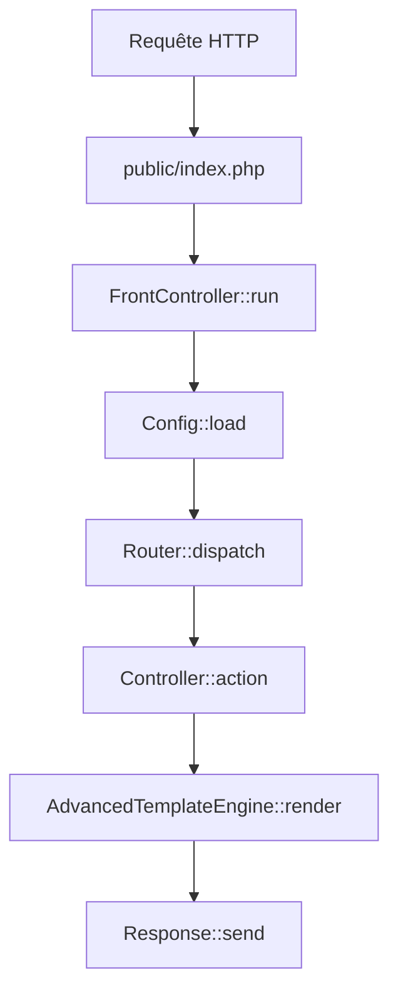

# Architecture interne de Lunar Quanta

Ce document détaille l'architecture interne du framework Lunar Quanta, ses composants principaux et leur interaction.

## Vue d'ensemble

Lunar Quanta suit une architecture **MVC moderne** avec les principes suivants :

- **Séparation des responsabilités** : Chaque composant a un rôle précis et défini
- **Injection de dépendances** : Container léger avec résolution automatique
- **Convention over configuration** : Conventions intelligentes avec possibilité de personnalisation
- **Performance** : Cache intelligent et compilation optimisée

## Cycle de vie d'une requête



### 1. Point d'entrée (`public/index.php`)

Le point d'entrée unique instantie et lance le `FrontController`.

### 2. FrontController (`src/Service/Core/FrontController.php`)

**Responsabilités :**
- Chargement des variables d'environnement (`.env`)
- Configuration du reporting d'erreurs selon `APP_DEBUG`
- Chargement de la configuration depuis `config/`
- Gestion globale des exceptions avec `ErrorController`

### 3. Router (`src/Service/Core/Router.php`)

**Fonctionnement :**
- **Scan automatique** : Parcourt `src/Controller/` pour trouver les attributs `#[Route]`
- **Cache intelligent** : Sauvegarde dans `cache/router.php` pour les performances
- **Résolution** : Match la requête avec la route appropriée
- **Invalidation** : Recompile automatiquement si les contrôleurs changent

**Exemple de route :**
```php
#[Route('/blog/{id}', name: 'blog_show', methods: ['GET', 'POST'])]
public function show(Request $request): Response
```

### 4. Container (`src/Service/Core/Container.php`)

**Container ultra-léger** avec :
- **Résolution récursive** : Instancie automatiquement les dépendances
- **Pattern Singleton** : Une instance par classe
- **Réflexion PHP** : Analyse des constructeurs pour injection

```php
$container = new Container();
$service = $container->get(BlogService::class);
// BlogService et ses dépendances sont automatiquement injectées
```

## Système de templates

### AdvancedTemplateEngine (`src/Service/Core/Template/AdvancedTemplateEngine.php`)

**Architecture en 3 phases :**

1. **Compilation** : Conversion de la syntaxe template en PHP
2. **Cache** : Stockage du PHP compilé dans `cache/template/`
3. **Rendu** : Exécution avec injection des variables

**Syntaxes supportées :**

```html
<!-- Variables -->
[[ variable ]]
[[ object.property ]]

<!-- Conditions -->
[% if condition %]
    Contenu conditionnel
[% elseif other_condition %]
    Autre contenu
[% else %]
    Contenu par défaut
[% endif %]

<!-- Boucles -->
[% for item in items %]
    <div>[[ item.name ]]</div>
[% endfor %]

<!-- Héritage -->
[% extends 'base.html.tpl' %]

[% block content %]
    Contenu spécifique
[% endblock %]

<!-- Macros -->
##url('route_name')##
##asset('/css/style.css')##
```

### Système d'héritage

```
base.html.tpl
├── [% block title %]
├── [% block content %]
└── [% block scripts %]

page.html.tpl extends base.html.tpl
├── [% block title %] → "Mon titre"
└── [% block content %] → "Mon contenu"
```

## Architecture des services

### Organisation modulaire

```
src/Service/
├── Cache/          # Gestion du cache
├── Command/        # Infrastructure CLI
├── Core/           # Composants centraux
│   ├── Config/     # Configuration
│   ├── Debug/      # Outils de debug
│   ├── Http/       # Request/Response
│   └── Template/   # Moteur de templates
├── Generator/      # Générateurs de code
├── Router/         # Service de routage
├── Security/       # Chiffrement
├── Server/         # Serveur de développement
└── Storage/        # Stockage JSON
```

### Exemples d'architecture

#### Service avec injection de dépendances

```php
namespace App\Service\Blog;

use App\Service\Storage\JsonStorage;
use App\Service\Security\EncryptionService;

class BlogService
{
    public function __construct(
        private JsonStorage $storage,
        private EncryptionService $encryption
    ) {}
    
    public function createPost(array $data): Post
    {
        $post = new Post($data);
        $encryptedData = $this->encryption->encrypt(
            serialize($post)
        );
        $this->storage->save('posts', $encryptedData);
        return $post;
    }
}
```

## Console CLI

### Architecture du système de commandes

```
bin/console
├── Scan de src/Command/
├── Détection des attributs #[Command]
├── CommandFactory::make()
├── Command::execute($args)
└── Affichage du résultat
```

### Cycle de vie d'une commande

1. **Découverte** : Scan automatique des classes `*Command.php`
2. **Instanciation** : Via `CommandFactory` avec injection de dépendances
3. **Exécution** : Appel de `execute($args)` avec gestion des erreurs
4. **Affichage** : Formatage coloré via `ConsoleHelper`

### Exemple de commande avancée

```php
#[Command(name: "blog:import", description: "Importe des articles")]
class BlogImportCommand extends AbstractCommand implements CommandInterface
{
    public function __construct(
        private BlogService $blogService,
        private ConfigService $config
    ) {}

    public function execute(array $args): int
    {
        $namedArgs = $this->parseNamedArgs($args);
        $source = $namedArgs['source'] ?? 'default';
        
        try {
            $posts = $this->importFromSource($source);
            C::success("✅ {count($posts)} articles importés");
            return 0;
        } catch (\Exception $e) {
            C::error("❌ Erreur : " . $e->getMessage());
            return 1;
        }
    }
}
```

## Gestion de la configuration

### Système de configuration hiérarchique

1. **Fichiers JSON** (`config/*.json`) : Configuration par défaut
2. **Variables d'environnement** (`.env`) : Configuration locale
3. **Cache** (`cache/config.php`) : Configuration compilée

```php
// config/database.json
{
    "database": {
        "host": "localhost",
        "port": 3306,
        "charset": "utf8mb4"
    }
}

// .env
DB_HOST=production-server
DB_PASSWORD=secret

// Utilisation
$host = Config::get('database.host', 'localhost'); // production-server
```

## Sécurité

### EncryptionService

**Algorithme :** AES-256-CBC avec HMAC-SHA256

```php
class EncryptionService
{
    public function encrypt(string $data): string
    {
        $iv = random_bytes(16);
        $encrypted = openssl_encrypt($data, 'AES-256-CBC', $this->key, 0, $iv);
        $hmac = hash_hmac('sha256', $iv . $encrypted, $this->key);
        
        return base64_encode($hmac . $iv . $encrypted);
    }
}
```

### JsonStorage sécurisé

- **Chiffrement automatique** des données sensibles
- **Validation des données** avant stockage
- **Gestion des erreurs** avec fallback

## Performance et optimisations

### Cache intelligent

- **Routes** : Compilation uniquement si modification détectée
- **Templates** : Cache basé sur `filemtime()`
- **Configuration** : Fusion et sérialisation des fichiers JSON

### Optimisations

1. **Autoloading optimisé** : PSR-4 avec `optimize-autoloader`
2. **Container singleton** : Une instance par classe
3. **Compilation à la demande** : Templates compilés seulement si nécessaire
4. **Cache de réflexion** : Réutilisation des métadonnées

## Tests et qualité

### Architecture testable

- **Injection de dépendances** : Facilite les mocks
- **Interfaces** : Découplage et testabilité
- **Services stateless** : Tests isolés et reproductibles

### Outils intégrés

- **PHPStan niveau 7** : Analyse statique stricte
- **PHP CS Fixer** : Style de code cohérent
- **Tests unitaires** : Infrastructure PHPUnit prête

---

Cette architecture garantit **simplicité**, **performance** et **maintenabilité** tout en respectant les meilleures pratiques du développement PHP moderne.