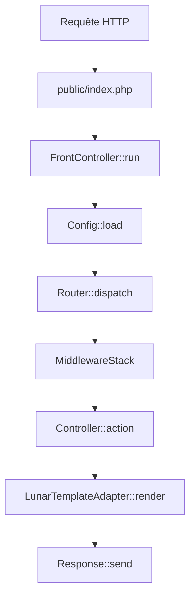
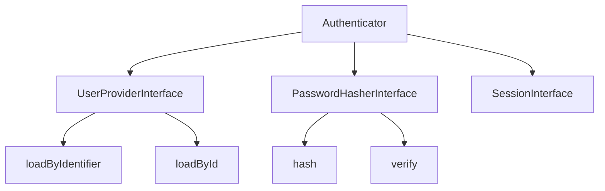

# Architecture interne de Lunar Quanta

Ce document détaille l'architecture interne du framework Lunar Quanta, ses composants principaux et leur interaction.

## Vue d'ensemble

Lunar Quanta suit une architecture **MVC moderne** avec les principes suivants :

- **Séparation des responsabilités** : Chaque composant a un rôle précis et défini
- **Injection de dépendances** : Container léger avec résolution automatique
- **Convention over configuration** : Conventions intelligentes avec possibilité de personnalisation
- **Performance** : Cache intelligent et compilation optimisée

## Cycle de vie d'une requête



### Pipeline de middlewares

Les middlewares s'exécutent en **FIFO** (premier ajouté, premier exécuté) avant le contrôleur,
puis en **LIFO** (dernier ajouté, premier exécuté) pour le retour :

```
Request → Middleware1 → Middleware2 → Controller → Middleware2 → Middleware1 → Response
```

### 1. Point d'entrée (`public/index.php`)

Le point d'entrée unique instantie et lance le `FrontController`.

### 2. FrontController (`src/Service/Core/FrontController.php`)

**Responsabilités :**
- Chargement des variables d'environnement (`.env`)
- Configuration du reporting d'erreurs selon `APP_DEBUG`
- Chargement de la configuration depuis `config/`
- Gestion globale des exceptions avec `ErrorController`

### 3. Router (`src/Service/Core/Router.php`)

**Fonctionnement :**
- **Scan automatique** : Parcourt `src/Controller/` pour trouver les attributs `#[Route]`
- **Cache intelligent** : Sauvegarde dans `cache/router.php` pour les performances
- **Résolution** : Match la requête avec la route appropriée
- **Invalidation** : Recompile automatiquement si les contrôleurs changent

**Exemple de route :**
```php
#[Route('/blog/{id}', name: 'blog_show', methods: ['GET', 'POST'])]
public function show(Request $request): Response
```

### 4. Container (`src/Service/Core/Container.php`)

**Container ultra-léger** avec :
- **Résolution récursive** : Instancie automatiquement les dépendances
- **Pattern Singleton** : Une instance par classe
- **Réflexion PHP** : Analyse des constructeurs pour injection

```php
$container = new Container();
$service = $container->get(BlogService::class);
// BlogService et ses dépendances sont automatiquement injectées
```

## Système de templates

Le moteur de templates est fourni par le package externe **[lunar/template](https://github.com/yrbane/lunar-template)**, intégré via l'adaptateur `LunarTemplateAdapter`.

### LunarTemplateAdapter (`src/Service/Core/Template/LunarTemplateAdapter.php`)

Adaptateur qui intègre le package `lunar/template` dans le framework. Il configure automatiquement :
- Les chemins des templates et du cache
- Les macros par défaut (`asset`, `url`)

### Package lunar/template

**Architecture en 3 phases :**

1. **Compilation** : Conversion de la syntaxe template en PHP
2. **Cache** : Stockage du PHP compilé dans `cache/template/`
3. **Rendu** : Exécution avec injection des variables

**Syntaxes supportées :**

```html
<!-- Variables -->
[[ variable ]]
[[ object.property ]]

<!-- Conditions -->
[% if condition %]
    Contenu conditionnel
[% elseif other_condition %]
    Autre contenu
[% else %]
    Contenu par défaut
[% endif %]

<!-- Boucles -->
[% for item in items %]
    <div>[[ item.name ]]</div>
[% endfor %]

<!-- Héritage -->
[% extends 'base.html.tpl' %]

[% block content %]
    Contenu spécifique
[% endblock %]

<!-- Macros -->
##url('route_name')##
##asset('/css/style.css')##
```

### Système d'héritage

```
base.html.tpl
├── [% block title %]
├── [% block content %]
└── [% block scripts %]

page.html.tpl extends base.html.tpl
├── [% block title %] → "Mon titre"
└── [% block content %] → "Mon contenu"
```

## Architecture des services

### Organisation modulaire

```
src/Service/
├── Cache/          # Gestion du cache
├── Command/        # Infrastructure CLI
├── Core/           # Composants centraux
│   ├── Config/     # Configuration
│   ├── Debug/      # Outils de debug
│   ├── Http/       # Request/Response
│   ├── Middleware/ # Infrastructure middleware
│   └── Template/   # Moteur de templates
├── Generator/      # Générateurs de code
├── Router/         # Service de routage
├── Security/       # Sécurité
│   ├── Auth/       # Authentification & autorisation
│   └── Csrf/       # Protection CSRF
├── Server/         # Serveur de développement
├── Session/        # Gestion des sessions
└── Storage/        # Stockage JSON
```

### Exemples d'architecture

#### Service avec injection de dépendances

```php
namespace App\Service\Blog;

use App\Service\Storage\JsonStorage;
use App\Service\Security\EncryptionService;

class BlogService
{
    public function __construct(
        private JsonStorage $storage,
        private EncryptionService $encryption
    ) {}
    
    public function createPost(array $data): Post
    {
        $post = new Post($data);
        $encryptedData = $this->encryption->encrypt(
            serialize($post)
        );
        $this->storage->save('posts', $encryptedData);
        return $post;
    }
}
```

## Console CLI

### Architecture du système de commandes

```
bin/console
├── Scan de src/Command/
├── Détection des attributs #[Command]
├── CommandFactory::make()
├── Command::execute($args)
└── Affichage du résultat
```

### Cycle de vie d'une commande

1. **Découverte** : Scan automatique des classes `*Command.php`
2. **Instanciation** : Via `CommandFactory` avec injection de dépendances
3. **Exécution** : Appel de `execute($args)` avec gestion des erreurs
4. **Affichage** : Formatage coloré via `ConsoleHelper`

### Exemple de commande avancée

```php
#[Command(name: "blog:import", description: "Importe des articles")]
class BlogImportCommand extends AbstractCommand implements CommandInterface
{
    public function __construct(
        private BlogService $blogService,
        private ConfigService $config
    ) {}

    public function execute(array $args): int
    {
        $namedArgs = $this->parseNamedArgs($args);
        $source = $namedArgs['source'] ?? 'default';
        
        try {
            $posts = $this->importFromSource($source);
            C::success("✅ {count($posts)} articles importés");
            return 0;
        } catch (\Exception $e) {
            C::error("❌ Erreur : " . $e->getMessage());
            return 1;
        }
    }
}
```

## Gestion de la configuration

### Système de configuration hiérarchique

1. **Fichiers JSON** (`config/*.json`) : Configuration par défaut
2. **Variables d'environnement** (`.env`) : Configuration locale
3. **Cache** (`cache/config.php`) : Configuration compilée

```php
// config/database.json
{
    "database": {
        "host": "localhost",
        "port": 3306,
        "charset": "utf8mb4"
    }
}

// .env
DB_HOST=production-server
DB_PASSWORD=secret

// Utilisation
$host = Config::get('database.host', 'localhost'); // production-server
```

## Système de Middlewares

### Architecture du pipeline

Le système de middlewares est inspiré de PSR-15, simplifié pour les besoins du framework.

```php
interface MiddlewareInterface
{
    public function process(Request $request, callable $next): Response;
}
```

### MiddlewareStack

Le `MiddlewareStack` gère l'exécution en chaîne des middlewares :

```php
$stack = new MiddlewareStack();
$stack->add(new SessionMiddleware())
      ->add(new CsrfMiddleware())
      ->add(new AuthMiddleware($auth));

$response = $stack->handle($request, fn($req) => $controller->action($req));
```

### Middlewares sur les routes

Les middlewares peuvent être attachés directement aux routes via l'attribut `#[Route]` :

```php
#[Route('/admin', middlewares: [AuthMiddleware::class, RoleMiddleware::class])]
public function admin(Request $request): Response
{
    // Le code ici ne s'exécute que si tous les middlewares passent
}
```

### Middlewares intégrés

| Middleware | Description |
|------------|-------------|
| `SessionMiddleware` | Démarre la session et l'attache à `$request->getAttribute('session')` |
| `CsrfMiddleware` | Valide les tokens CSRF sur POST/PUT/PATCH/DELETE |
| `AuthMiddleware` | Requiert un utilisateur authentifié |
| `GuestMiddleware` | Requiert un utilisateur NON authentifié (pour login) |
| `RoleMiddleware` | Vérifie les rôles de l'utilisateur |

## Gestion des Sessions

### SessionService

Le `SessionService` gère les sessions PHP avec des options sécurisées par défaut :

```php
$session = new SessionService();
$session->start();

// Données persistantes
$session->set('user_id', 123);
$userId = $session->get('user_id');

// Messages flash (une seule lecture)
$session->flash('success', 'Opération réussie !');
$message = $session->getFlash('success'); // "Opération réussie !"
$message = $session->getFlash('success'); // null (consommé)

// Régénération de l'ID de session (après login)
$session->regenerate();

// Destruction complète
$session->destroy();
```

### Options de sécurité

Le `SessionService` configure automatiquement :
- `cookie_httponly: true` - Protection XSS
- `cookie_samesite: Lax` - Protection CSRF basique
- `use_strict_mode: true` - Refuse les IDs de session non initialisés
- `cookie_secure: true` - HTTPS seulement (si HTTPS détecté)

## Protection CSRF

### Fonctionnement

La protection CSRF utilise un token stocké en session :


### CsrfTokenManager

```php
$csrf = new CsrfTokenManager($session);

// Génération (stocke automatiquement en session)
$token = $csrf->generate('form_contact');

// Validation (timing-safe avec hash_equals)
if ($csrf->isValid('form_contact', $submittedToken)) {
    // Token valide
}

// Suppression après utilisation (one-time token)
$csrf->remove('form_contact');
```

### CsrfMiddleware

Le middleware valide automatiquement les tokens sur les requêtes non-sûres :

- **Safe methods** (ignorés) : GET, HEAD, OPTIONS, TRACE
- **Validated methods** : POST, PUT, PATCH, DELETE

Le token peut être envoyé via :
- Body: `_csrf_token`
- Header: `X-CSRF-Token`

## Système d'Authentification

### Architecture



### Authenticator

Le service principal d'authentification :

```php
$auth = new Authenticator($userProvider, $passwordHasher, $session);

// Tentative de connexion
$user = $auth->attempt('email@example.com', 'password');
if ($user) {
    // Connecté, session régénérée
}

// Vérifications
$auth->check();   // true si connecté
$auth->guest();   // true si non connecté
$auth->user();    // UserInterface|null
$auth->id();      // ID de l'utilisateur|null

// Validation sans connexion
$auth->validate('email', 'password'); // bool

// Déconnexion
$auth->logout();
```

### UserInterface

Toute entité utilisateur doit implémenter :

```php
interface UserInterface
{
    public function getId(): string|int;
    public function getIdentifier(): string;  // email ou username
    public function getPassword(): string;    // hash
    public function getRoles(): array;        // ['ROLE_USER', 'ROLE_ADMIN']
}
```

### PasswordHasher

Hachage sécurisé avec bcrypt ou Argon2id :

```php
// Factory methods
$hasher = PasswordHasher::bcrypt(cost: 12);
$hasher = PasswordHasher::argon2id();

// Utilisation
$hash = $hasher->hash('password');           // Hash sécurisé
$valid = $hasher->verify('password', $hash); // Validation
$needsRehash = $hasher->needsRehash($hash);  // Mise à jour nécessaire ?
```

### InMemoryUserProvider

Pour le prototypage et les tests :

```php
$provider = new InMemoryUserProvider();
$provider->createUser(1, 'admin@example.com', 'secret', $hasher, ['ROLE_ADMIN']);
$provider->createUser(2, 'user@example.com', 'password', $hasher, ['ROLE_USER']);

$user = $provider->loadByIdentifier('admin@example.com');
$user = $provider->loadById(1);
```

### UserProviderInterface personnalisé

Pour charger depuis une base de données :

```php
class DatabaseUserProvider implements UserProviderInterface
{
    public function __construct(private PDO $pdo) {}

    public function loadByIdentifier(string $identifier): ?UserInterface
    {
        $stmt = $this->pdo->prepare('SELECT * FROM users WHERE email = ?');
        $stmt->execute([$identifier]);
        $row = $stmt->fetch();

        return $row ? new User($row) : null;
    }

    public function loadById(string|int $id): ?UserInterface
    {
        $stmt = $this->pdo->prepare('SELECT * FROM users WHERE id = ?');
        $stmt->execute([$id]);
        $row = $stmt->fetch();

        return $row ? new User($row) : null;
    }
}
```

## Sécurité

### EncryptionService

**Algorithme :** AES-256-CBC avec HMAC-SHA256

```php
class EncryptionService
{
    public function encrypt(string $data): string
    {
        $iv = random_bytes(16);
        $encrypted = openssl_encrypt($data, 'AES-256-CBC', $this->key, 0, $iv);
        $hmac = hash_hmac('sha256', $iv . $encrypted, $this->key);
        
        return base64_encode($hmac . $iv . $encrypted);
    }
}
```

### JsonStorage sécurisé

- **Chiffrement automatique** des données sensibles
- **Validation des données** avant stockage
- **Gestion des erreurs** avec fallback

## Performance et optimisations

### Cache intelligent

- **Routes** : Compilation uniquement si modification détectée
- **Templates** : Cache basé sur `filemtime()`
- **Configuration** : Fusion et sérialisation des fichiers JSON

### Optimisations

1. **Autoloading optimisé** : PSR-4 avec `optimize-autoloader`
2. **Container singleton** : Une instance par classe
3. **Compilation à la demande** : Templates compilés seulement si nécessaire
4. **Cache de réflexion** : Réutilisation des métadonnées

## Tests et qualité

### Architecture testable

- **Injection de dépendances** : Facilite les mocks
- **Interfaces** : Découplage et testabilité
- **Services stateless** : Tests isolés et reproductibles

### Outils intégrés

- **PHPStan niveau 7** : Analyse statique stricte
- **PHP CS Fixer** : Style de code cohérent
- **Tests unitaires** : Infrastructure PHPUnit prête

---

Cette architecture garantit **simplicité**, **performance** et **maintenabilité** tout en respectant les meilleures pratiques du développement PHP moderne.